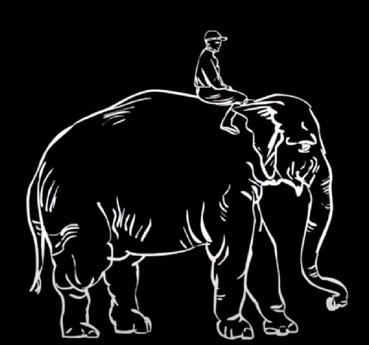

# EMOTIONAL

&rarr; Making people care.

---

People can believe your message and don't give a clue about it !

You can believe me if I pitch you something about the municipal sewage system, you could believe my facts are right... It doesn't mean you're gonna care about it. It doesn't mean you're going to do anything, change your behaviour.

We must make our audience **care** about our messages.

---

### Detour into cognitive psychology

#### Rational System VS Emotional System of thought in our brain

The `rational system` is the one who knows you should be eating healthy, you shouldn't smoke, you shouldn't stay in a bad relationship, you shouldn't procrastinate... It sets goals to the future, plans the right paths to follow...

But why don't we just do it then ?

The `emotional system` runs all the auto-pilot behaviour we barely think about. It's also the part of us that _craves_.

These two systems fight for dominance in our brain. But unfortunately it's not a fair fight. :(

Our emotional system is much bigger and virulent thant the rational system.

---

Compare this to an image : a big elephant (our emotional system) with a small human (our rational system) "leading" the elephant by the reins.

The funny thing is that our rational system really thinks he is the one in charge.

Yes, the rider gives directions to the elephant, but if these two disagree, on whom will you bet your money ?

---

In a business organization, when we want things to change, we want our colleagues to do something different, we come at them with charts, and datas, and graphs, and memos... But all we're doing is talking to the little human on top of the elephant.

And meanwhile, there is this big elephant in the brain of everybody we are trying to reach, that is pretty confortable with the way things were working last week and the month before.

---

### Why so many messages fail to spark change ?

> We speak to the driver instead of the elephant

> Knowledge is not sufficient to spark change

It's not untill we really care about something that our behaviour changes.

We think the path to change is :

- Analyze
- Think
- Change

But actually it's :

- See
- Feel
- Change

---

### How to speak to the elephant and not the driver ?

Depending on what field you are, it can seem very difficult to tap into something emotional. Think of legal, accounting, HR...

Then... forget the word `emotion`. Just think of the **WHY** is the message you want to communicate **important** ? **Why does it matter to you** ?

You keep pushing on that and eventually you're going to drill down and hit emotion !

---

A new regional manager of the McDonals franchise had to tell people that the company had lost 0.3 pts market share. This message as such doesn't talk to the elephant at all.

CORE MESSAGE of the meeting : `We should care about the 0.3 market share drop`

Where the hell you find emotion in "0.3 points of market share" ?

Keep asking "why" ! Why is this important ?

What did she do ?

She presented to the employees a big check made out to Burger King, Taco Bell and Wendy's of 240.000$ with a generous memo : "a generous gift".

"That's what
