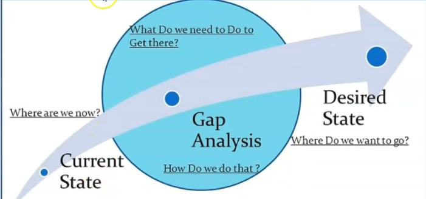

# Learner Analysis

---

Focus on the learners !

- Skills

  - Current state
  - Desired state
  - Gap analysis



- Environment of learner

- Learning preferences

  - Auditory
  - Visual
  - Kinesthetic

```
(Incorporate all the learning types in the course : Use audio at the same time of text and visual elements, create little videos... Put transcript for each video/audio, etc.)
```

- Company team and available skills

- Company LMS and technology infrastructure.

---

**Why** do we need to teach ?
**What** will we teach ?
**Where** it will happen?
**When** will it happen ?
**How** it will happen?
For **whom** are we designing the content ?
