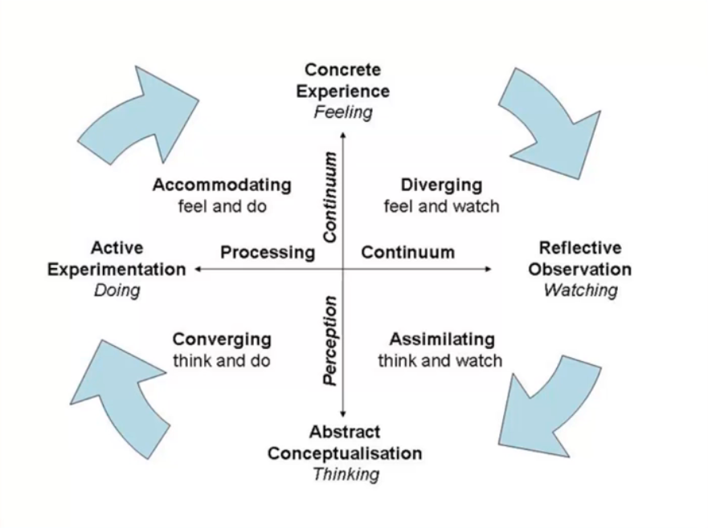

# Kolb's theory on Experiential Learning

---

David Kolb thinks **learning as an experience**.

- How do we change from the information we were provided ?

---

### Kolb Simplified

**DO** : We do

**Think** : We think about what we have done and we are provided with more information.

**Conclude** : Conclude what we need to change

**Adapt** : We do those changes

**Do again** : Repeat, repeat, repeat.

---

Repetitive cycle untill it becomes habit.
