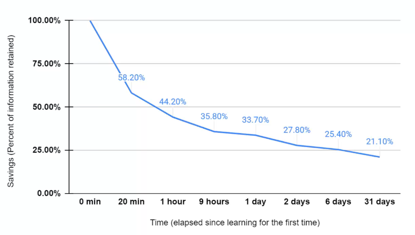

## Forgetting curve

---

Remember that your learners forget. So provision for this. (Continuous learning design)

---

## Continuous learning

How can we drip feed the need to know information.

When to have refreshers and when ? Weekly ? Monthly ? How much time they have to refresh ?

---

## Bite sized Learning

1 Hour rigid course complete in one go (problematic for some)

Multiple bite-sized learning resources. (15 min is a nice number)

---

## Variety
