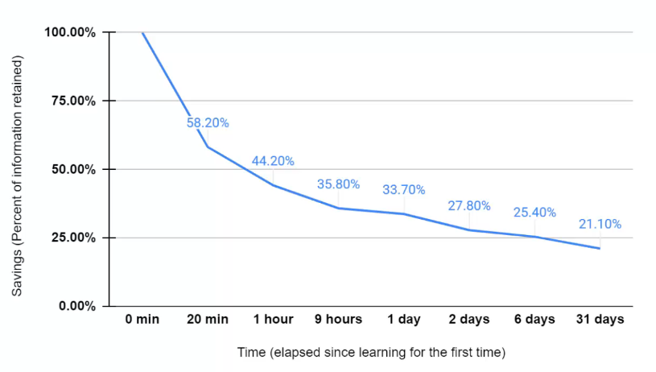

## The complete Instructional Designer course - John Hinchliffe

---

**What is Instructional Design ?**

Instructional design is the process of creating effective and engaging learning experiences and educational materials.

It involves analyzing learners' needs, designing, learning objectives, creating instructional content, and developing assessments to measure learning outcomes.

The goal of instructional design is to ensure that learners acquire knowledge and skills in the most efficient and impactful way possible.

**Pedagogy**

Pedagogy is the study of how knowledge and skills are exchanged in an educational context, and it considers the interactions that take place during learning. (Wikipedia)

---

Simplified :

> How do we take information and present it to our learners ?

---

Questions to be asked :

- Who are our learners ?

- Where are they leraning ?

- How are they learning ?

- What device are they using ?

**What will engage them ?**

--> Great learning experience
--> People must retain information

---

---

# Flipped Classrooms

---

Flip the conventional way. Which is :

- Present the content in the teacher's pace.
- Then exercise by homework etc.

Flipped classroom aims to the opposite :

- Allowing people to learn at their own pace, get the knowledge they need, to, then, be able to go further thanks to discussion, social learning, being able to exchange ideas, etc.

---

Did you know a study has showed that we forget 70% of what we learned within 24 hours ?

How can we improve this ? Is repetition of knowledge in order to really make it stick a good way ?

---

---

# The past of learning

---

- Mainly someone speaking at us
- Cramming for tests (bourrer de tests)
- Focus on short-term recollection
- People in the same place at a designated time/date

It didn't take into account what was going on with the learner, how they learned.

For many people, having this "one-direction" flow didn't resonate with them.

---

Other problems :

- Information overload
- We are human, we forget.
- We miss information if we are distracted or sick.
- Maybe the person who is teaching is not engaging --> difficult to recollect information.

---

# The present

---

### 01. Formal

---

**Synchrounous vs Asynchronous**

**Synchronous** is happening at the same time for all (can be front-to-front, webinar...)

**Asynchronous**

- At a time that suits the learner
- Allow people to lear at their speed.
- Can delve deeper where needed

We learn at different speeds ! Sometimes we go fast for some materials, sometimes slower.

People will have the material later on as well

(Flipped classrooms can be a very nice option)

---

**Digital learning in different mediums**

- Authoring tools (softwares that are designed to provide elearning experiences)

- Videos

- Podcasts

- Articles

AI can help us a lot to write copies.

Quality is key !! No bad images or **sound** !

---

**Creatin and curation**

_Content curation is the process of gathering information relevant to a particular topic or area of interest, usually with the intention of adding value through the process of selecting, organizing and looking after the items that are relevant for our goals_

When curating :

- Identify what we want to acomplish
- Identify source content
- Critique the content (is it right ? relevant ? reputable source ?)
- Create an experience (how do we provide the content, not too long, bite sizes)
- Publish your resource (which platform ? Where to publish it ?)
- Housekeeping (Make sure the content is still acessible, still relevant...)
- Investigate (look if people are engaged in what, etc.)

---

**Platforms**

Where to host our course ?

- eLearning platforms ? (easy and ability to analyze data)

---

### Informal

---

**Learning the flow**

- Make sure to be able to provide people with the answers they need to questions, being able to provide a resource that they need when they need it, and also being easily searchable and bite sized.

---

**Non traditional learning platforms**

- Goole (search)
- YouTube
- Twitter ? TikTok ? Instagram ?

Short answers on Instagram for example. "**How do I do something ? I don't want to take a full course**".

---

# The Future

---

- Augmented reality
- Virtual Reality
- AI

---

Think at AI :

- AI generated video presenters
- Platforms being able to undestand what people need and providing this to them.
- The blockchain housing certifications and accreditations (for accreditation, certifications ?)
- Deeper data analyses and reporting being provided.

---

- Provide refresher resources
- Utilise different mediums to allow people to deep dive.
- Implement **content curation**
- Make informal learning a part of your learning strategy.

---

---

## Forgetting curve

---

Remember that your learners forget. So provision for this. (Continuous learning design)

---

## Continuous learning

How can we drip feed the need to know information.

When to have refreshers and when ? Weekly ? Monthly ? How much time they have to refresh ?

---

## Bite sized Learning

1 Hour rigid course complete in one go (problematic for some)

Multiple bite-sized learning resources. (15 min is a nice number)

---

## Variety

Varying the style of learning in one same course is a nice way of implementing variety.

---

---

# Don'ts

---

**design**

- Don't try and be too loud with your design.
- We are more in a minimalistic design.

**Too much text**

NEVER ! (Make clickable to reveal texts ?)

---

---

# Analysis

---

**Action mapping**

Action mapping focuses on looking at the concept of what you want to create

Ex of incremental analyses:

1. Couse on business --> How to invest in stocks and shares
2. WHY ? --> There is demand from the learners
3. Where are you learners and how they access this information ? --> X country, age range, mobile phones. So ? What media ?

Breaking down information into key points.

**PERSONAS**

What is the profile of the learners.

- Who are they ? Age, level, interest...
- What do they need and want from this learning ?
- How much time they have ?
- Languages ?

**ROI/KPIs**

Key performance indicators

- I need learners to score 80% on their assesments

Return on investment

- After a sales training, sales must improve 50%

---

---

# Design

---

**Creating storyboards**

Important

---

**Subject Matter Expert**

- If we don't have enough ressources with google, ia, youtube... Think of hetting an expert.

**Micro-learning**

Historically learning was between 45 min and 1h long. Which can be very long to keep all the information.

Microlearning breaks down information.

1h long material should be break down to 6 times 10 minutes for example.

**Interactive videos**

Authoring **storyline** allows us to put buttons in a video to go further in explanations.

**Storytelling**

Create characters for example to go through the material with theu story.

**Gamification**

Bad learning + gamification = BAD experience.

- Providing scenarios/storytelling
- Safe immersive environments
- Rewards

**Look and feel**

We expect so much on how things look.Never minimize the graphic design aspect of it.

---

---

## 12 elearning authoring tools to consider

In this review, we’ll be taking a deeper dive into 12 online learning software examples you might want to consider. Specifically, we’ll be looking at:

**Elucidat** – Helps teams to create an impactful elearning quickly and easily by unlocking expertise from any employee

**Adobe Captivate** – Gives experienced authors the power to create high-quality content

**Articulate Storyline 360** – Ideal for individual users who prefer

**PowerPoint**, with an added layer of customization

**Articulate Rise 360** – Users with access to Articulate 360 can produce simple elearning courses fairly quickly

**Gomo** – Best for experienced learning designers that are not looking for advanced customization

**Lectora** – Gives traditional, capable authors an effective tool for producing HTML5 content

**Adapt** – Designed for technical authors who are looking to design bespoke HTML5 authoring through back-end design

**DominKnow** – Perfect for teams whose focus is on responsive screen capture and software simulation

**Easygenerator** – Authoring software designed for learning teams who need to create elearning content, easily

**iSpring Suite** – Desktop PowerPoint-based tool that’s a great option for novice learning designers who don’t have to worry about updating content regularly

**Evolve** – Built for teams who need to collaborate together and don’t mind putting in the time to learn how to use it

**Camtasia** – Video editing suite most commonly used for screen recordings, tutorials or product demos.

---

---

# Portfolio

---

Try demo is the best
But we can use screenshots of the learning experience.
